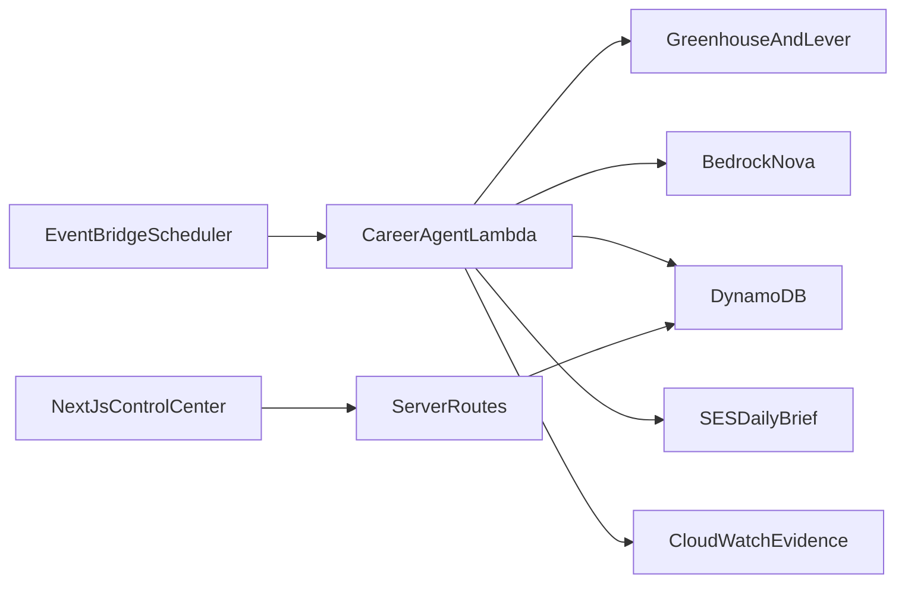

# Architecture

Opportun-AI-t is a single-user autonomous career agent for the Weekend Agent Challenge. The agent runs unattended on a schedule; the Next.js control center only displays and edits results.

## Components

| Piece | Role |
|-------|------|
| EventBridge Scheduler | Daily 08:00 `Asia/Kolkata` invoke (`opportun-ai-t-daily-8am`) |
| Lambda (`opportun-ai-t-career-agent`) | Idempotent pipeline: fetch → dedupe → Bedrock → persist → SES |
| DynamoDB (single-table) | Profile, sources, jobs, evaluations, applications, follow-ups, runs, reports |
| Bedrock Nova Lite | Structured job evaluation + digest via Converse (`apac.amazon.nova-lite-v1:0`) |
| SES | Daily briefing only (follow-up drafts are stored, never auto-sent) |
| CloudWatch | Structured JSON logs, EMF metrics (`OpportunAiT`), dashboard `Opportun-AI-t`, alarms |
| Next.js 15 (`apps/web`) | Control center over DynamoDB (or demo seed when `TABLE_NAME` empty) |

## Trigger flow

1. Scheduler delivers an invoke for the local calendar date in `SCHEDULE_TIMEZONE`.
2. Lambda claims a `RUN` record (skip if already completed / email sent; reclaim stale `RUNNING` or `FAILED`).
3. Load profile + enabled sources; fetch Greenhouse/Lever public boards; fingerprint + dedupe.
4. Evaluate up to `ANALYSIS_CAP` new jobs with Bedrock (dry-run stubs locally).
5. Create review-only follow-up drafts for stale applications; derive weekly trend.
6. Persist daily report; send SES digest; emit EMF metrics; finalize run status.

## Shared domain

`@opportun-ai-t/core` owns Zod schemas, DynamoDB key helpers, fingerprints, and dedupe/stale-follow-up helpers so Lambda and the web app read/write the same items.

## Observability (challenge evidence)

- Structured logs: `career_agent_invoke`, `pipeline_start`, `pipeline_completed` / `pipeline_failed`, Bedrock/SES errors.
- EMF namespace `OpportunAiT`: jobs fetched/new/deduped/analyzed, Bedrock errors, email sent, run completed/skipped/failed, duration.
- Dashboard widgets: Lambda invocations/errors/duration, custom pipeline metrics, DLQ, alarms, recent log filter.

## Explicit MVP boundaries

No Ashby/Wellfound crawling, no multi-user auth, no auto-apply, no auto-send of follow-up emails. Amplify Hosting app shell is provisioned; GitHub OAuth connect is documented in `docs/deployment.md`.
